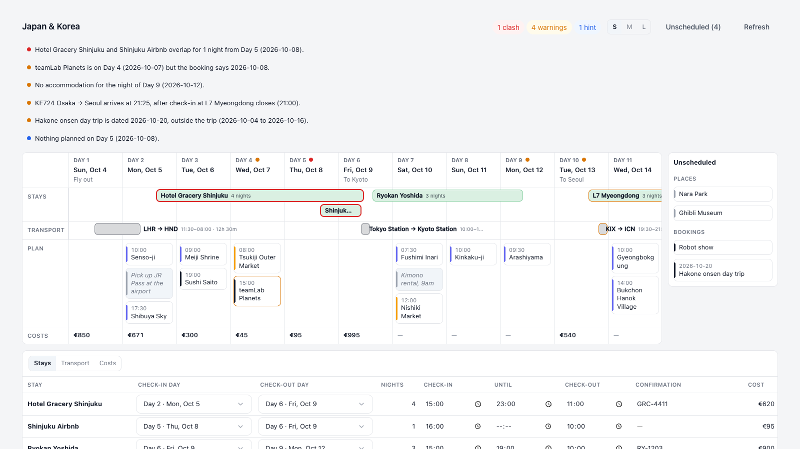

# Trek Timeline

See the whole trip on one timeline. Drag stays, transport and plans between days, spot gaps
and clashes, and edit stay and transport details in a spreadsheet grid.



## What it does

Trek Timeline adds a **Trek Timeline** tab to every trip. The top half is a timeline of the trip with one
column per day:

- **Stays** are bars that run from check-in to check-out. Drag a bar to move the stay, or drag
  either end to change the check-in or check-out day and time.
- **Transport** bars run from the local departure time to the local arrival time. The label shows
  the real time in transit, so a 12h 30m flight that lands "earlier" by the clock still reads
  correctly. Drag a bar to change when it leaves. The arrival and every leg move with it, keeping
  the time in transit, and crossing midnight updates the dates and days.
- **Plan** shows each day's places, notes and bookings in TREK's order. Drag them within a day or
  to another day.
- **Day headers** can be dragged to reorder whole days. As in TREK, the dates stay in place and the
  days move, so bookings on a moved day take its new date.
- **Costs** shows the total for each day, in the trip currency.

Stay and transport drags change the time as well as the day. A tooltip shows exactly where the
bar will land, and the drag snaps to 15, 30 or 60 minutes depending on the zoom. Hold **Shift**
to move by whole days and keep the current times.

Next to the timeline, an **Unscheduled** list holds places that aren't on any day and bookings
without a date. Drag them onto a day to plan them.

Trek Timeline also checks the trip and flags problems on the timeline and in TREK's own warnings list:

- nights with no accommodation (an overnight flight or train counts as a bed)
- stays that overlap
- arriving after a hotel's check-in window closes
- a booking whose date doesn't match the day it sits on
- bookings dated outside the trip
- days with nothing planned

Some edits have side effects, for example re-dating bookings or changing a stay's length. These show
a preview of what will change and ask for confirmation first. When a booking has a confirmation code,
the preview reminds you that only TREK changes, not the booking with the provider.

Below the timeline, the **sheet** has three tabs. Click a stay or transport bar (or press **Enter**
on it) to jump to its row. Cells save when you press **Enter** or leave them; **Escape** abandons
the edit.

- **Stays**: check-in and check-out days, times and confirmation codes, all editable inline.
- **Transport**: departure day, local departure and arrival times, status and confirmation, all
  editable inline.
- **Costs**: a read-only total by category. For a category-grouped budget spreadsheet, use the
  [Budget Table](https://github.com/jubnl/Trek_Plugin-Budget_Table) plugin alongside this one.

Edits from other people on the trip appear without reloading. Every drag has a keyboard equivalent:
focus an item, press **M**, choose a destination with the arrow keys and press **Enter**. For stays
and transport, the arrow keys move by days and **,** and **.** move by 15 minutes. On a stay, hold
**Shift** to move only the check-out or **Alt** to move only the check-in. On a
phone, the timeline becomes a list of days with a "Move to…" picker.

### What needs a newer TREK

TREK doesn't yet let plugins reorder days, move places between days or reorder them within a day,
or move notes between days. Until it does, Trek Timeline turns those gestures off and explains why.
Everything else works on TREK 4.0 and later: moving and resizing stays, moving bookings, reordering
notes within a day, planning from the Unscheduled list, grid edits and warnings.

## Screenshots


## Permissions

| Permission                   | Why                                                                                                                                                |
| ---------------------------- | -------------------------------------------------------------------------------------------------------------------------------------------------- |
| `db:read:trips`              | Read the trip, its days (with planned places and notes), bookings, stays and places to draw the timeline.                                          |
| `db:read:costs`              | Show per-day, per-stay and per-category totals. If this is missing or the Costs addon is off, the timeline still works without costs.              |
| `db:write:days`              | Reorder whole days when you drag a day header (once supported by TREK).                                                                            |
| `db:write:itinerary`         | Plan an unscheduled place on a day, and move places between or within days.                                                                        |
| `db:write:accommodations`    | Move a stay, change its nights, and edit check-in and check-out times and confirmation codes.                                                      |
| `db:write:reservations`      | Move a booking to another day (with its times and transport legs), plan an undated booking, and edit titles, times, status and confirmation codes. |
| `db:write:daynotes`          | Reorder a note within its day, and move notes between days once supported by TREK.                                                                 |
| `hook:trip-warning-provider` | Add the plugin's gap and clash checks to TREK's own warnings list for the trip.                                                                    |

All writes go through TREK with your own permissions, so a trip member who can't edit sees the
timeline read-only. The plugin makes no network requests of its own and stores no data.

## Setup

1. Install **Trek Timeline** from **Admin → Plugins → Discover**, then activate it.
2. Open any trip. The **Trek Timeline** tab appears in the trip planner.

In **Settings → Plugins → Trek Timeline**, each user can choose whether to be warned about:

- **Flag nights without accommodation** (on by default). Turn this off for trips where you camp or
  stay with friends.
- **Flag days with nothing planned** (on by default).

## Development

The plugin is written in TypeScript under `src/` (Node 22.18 or later runs the `.ts` files
directly). `npm run build` bundles it with esbuild into what TREK loads: `server/index.js` (one
CommonJS file) and `client/` (the page as one classic script). Both are build output and are not
committed. `pack`, `status`, `dev`, `shot` and `test:e2e` build first.

```bash
npm install
npm test            # unit + route tests (node:test, SDK mock host), straight from src/
npm run typecheck   # tsc over the server, the page, the tests and the scripts
npm run format      # Prettier (format:check to verify without writing)
npm run build       # src/ → server/ and client/
npm run sandbox     # http://localhost:4318: the page against an in-memory TREK, rebuilt on change
npm run test:e2e    # browser tests against the sandbox (Playwright; falls back to local Chrome)
npm run shot        # regenerate docs/screenshot.png
npm run dev         # the SDK's own dev server, fed from the same fixture trip
npm run pack        # plugin.zip
```

The **sandbox** is the quickest way to try changes. It runs the real page in TREK's sandboxed
iframe and backs it with an in-memory TREK, so edits persist and live updates arrive the way they
do in TREK. Its toolbar has switches for:

- the not-yet-released plugin methods
- read-only membership
- the mobile layout
- simulating a collaborator's edit
- resetting the data

The fixture trip (`test/fixtures/trip.ts`) is deliberately imperfect, so every warning shows up.
`npm run dev` uses the SDK's mock host, which stores fixtures but doesn't apply writes to later
reads. Use the sandbox to try edits end to end.

## License

Apache 2.0
